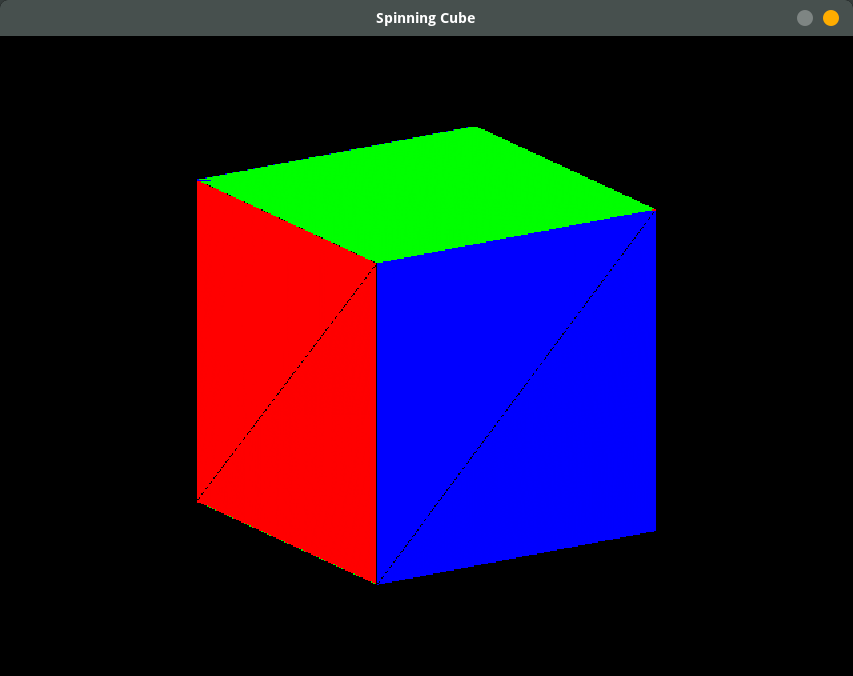

# Euc

A software rendering crate that lets you write shaders in Rust.



## Example

```rust
struct Triangle;

impl Pipeline for Triangle {
    type Uniform = Nothing;
    type Vertex = [f32; 3];
    type VsOut = Nothing;
    type Pixel = [u8; 4];

    fn vert(_: &Self::Uniform, pos: &[f32; 3]) -> ([f32; 3], Self::VsOut) {
        (*pos, Nothing)
    }

    fn frag(_: &Self::Uniform, _: &Self::VsOut) -> Self::Pixel {
        [255, 0, 0, 255] // Red
    }
}

const W: usize = 640;
const H: usize = 480;

fn main() {
    let mut color = Buffer2d::new([W, H], [0; 4]);
    let mut depth = Buffer2d::new([W, H], 1.0);

    Triangle::draw::<rasterizer::Triangles<_>, _>(
        &Nothing,
        &[
            [-1.0, -1.0, 0.0],
            [ 1.0, -1.0, 0.0],
            [ 0.0,  1.0, 0.0],
        ],
        &mut color,
        &mut depth,
    );
}
```

## Why?

- Writing rendering code on the CPU requires significantly less boilerplate setup code than on the GPU, and so is brilliant for playing around with ideas.

- Modern CPUs are fast enough to make lightweight software-rendered programs run at reasonable speeds (although they are of course no match for GPUs).

- Writing a software renderer is a brilliant way to learn about modern 3D rendering techniques.

## Performance Concerns

Cargo, by default, compiles Rust code in debug mode.
In this mode, very few optimisations are made upon the code, and as a result the performance of software rendering tends to suffer.
To experience this project with decent performance, make sure you compile with the `--release` flag.

## Goals

- Support for programmable shaders

- Simple, clear interface

## Non-Goals

- Correctness

- Extreme optimisation

- Compliance with an existing API (i.e: OpenGL)
