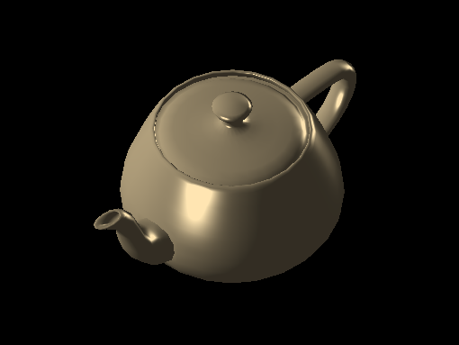

# 

[](https://crates.io/crates/euc)
[](https://docs.rs/euc)
[](https://github.com/zesterer/euc)


# 

## Example

```rust
struct Triangle;

impl Pipeline for Triangle {
    type Vertex = [f32; 2];
    type VertexData = ();
    type Pixel = [u8; 4];

    // Vertex shader
    fn vert(&self, pos: &Self::Vertex) -> ([f32; 4], Self::VertexData) {
        ([pos[0], pos[1], 0.0, 1.0], ())
    }

    // Fragment shader
    fn frag(&self, _: Self::VertexData) -> Self::Pixel {
        [255, 0, 0, 255] // Red
    }
}

let mut color = Buffer2d::new([640, 480], [0; 4]);

Triangle.render(
    &[[-1.0, -1.0], [ 1.0, -1.0], [ 0.0, 1.0]],
    CullMode::Back,
    &mut color,
    &mut Empty::default(),
);
```

## What is `euc`?

`euc` is a [software-rendering](https://en.wikipedia.org/wiki/Software_rendering)
crate for rendering 3D scenes on the CPU. The API is designed to be clean,
powerful, and heavily leans on Rust's type system to ensure correct usage.

`euc` is fast enough to render simple scenes in real-time and supports
thread-based parallelism to accelerate rendering.

## Features

- Write shaders in Rust (vertex, geometry, fragment and blend shaders)
- Multithreading support for parallel rendering acceleration
- Many supported primitives (triangles, lines, points, etc.)
- Textures and texture samplers
- Customisable coordinate space
- Built-in support for index buffers

## Why?

Below are a few circumstances in which you might want to use `euc`.

### Learning and experimentation

Modern graphics APIs are complex, verbose beasts. The code required to set them
up properly requires a lot of beaurocratic mumbo jumbo. This problem has only
become worse with the latest iteration of graphics APIs. Vulkan's canonical
['Hello Triangle' example](https://vulkan-tutorial.com/code/16_swap_chain_recreation.cpp)
is, when shader code is included, 994 lines of code. Compare that to `euc`'s 34.
This is obviously not without tradeoff: Vulkan is a powerful modern graphics API
that's designed for high-performance GPGPU on a vast array of hardware while
`euc` is simply a humble software-renderer.

However, for someone new to 3D rendering that wants to explore new techniques
without all of the beaurocratic cruft, `euc` might well serve a useful purpose.

### Static images, pre-renders, and UI

`euc` may not be well-suited to high-performance real-time graphics, but there
are many applications that don't require this. For example,
[Veloren](https://veloren.net/) currently uses `euc` to pre-render 3D item
models as icons to be displayed in-game later.

`euc` is also more than fast enough for soft real-time applications such as UI
rendering, particularly for state-driven UIs that only update when events occur.
In addition, tricky rendering problems like font rasterization become much
simpler to solver on the CPU.

### Embedded

`euc` doesn't require `std` to run. Are you writing a toy OS? Do you want a
pretty UI with a 3D graphics API but you don't want to write your own GPU
drivers? `euc` has you covered, even for simple real-time graphics.

### Testing

`euc` doesn't need a GPU to run. Most servers and CI machines don't have access
to one either. If you want to check the consistency of some rendered output,
`euc` is perfect for the job.

### Unconventional environments

Access to render surfaces for most modern graphics APIs is done through a window
manager or similar such component that manages access to framebuffers. Don't
have access to that because you're writing a 3D command-line game? `euc` might
be what you're looking for. In addition, `euc` uses Rust's type system to allow
rendering to unconventional framebuffer formats. Now you can render to a `char`
buffer!

### Relaxed data access patterns

GPUs are brilliantly fast, but there's a reason that we don't use them for
everything: they're also *heavily* optimised around very specific kinds of data
manipulation. CPUs are more general-purpose and as a result, `euc` allows much
more dynamic access to rendering resources.

## Coordinate System

By default, `euc` uses a left-handed coordinate system with 0-1 z clipping (like
Vulkan). However, both of these properties can be changed independently and
`euc` provides coordinate system constants that correspond to those of common
graphics APIs such as:

- `CoordinateMode::VULKAN`
- `CoordinateMode::OPENGL`
- `CoordinateMode::METAL`
- `CoordinateMode::DIRECTX`

Note that using these constants do not change the coordinates of things like
texture samplers, yet.

## Release Mode

Cargo, by default, compiles Rust code in debug mode. In this mode, very few
optimisations are made upon the code, and as a result the performance of
software rendering tends to suffer. To experience this project with good
performance, make sure to compile with the `--release` flag.

## `no_std`

`euc` can be compiled on platforms that lack standard library support. This
makes it ideal for rendering 3D graphics on embedded devices. You can enable
`no_std` support by disabling the default features and enabling the `libm`
feature in your `Cargo.toml` file like so:

```toml
[dependencies]
euc = { version = "x.y.z", default-features = false, features = ["libm"] }
```

## Goals

- Support programmable shaders written in Rust.

- Support common pipeline features such as texture samplers, multiple rendering
  passes, uniform data, etc.

- Simple, elegant API that scales well and doesn't get in the way.

- Correctness, where doing so doesn't significantly compromise performance.

## Non-Goals

- Extreme optimisation (although obvious low-hanging fruit will be picked).

- Compliance/compatibility with an existing API (i.e: OpenGL).

## License

`euc` is distributed under either of:

- Apache License, Version 2.0, (LICENSE-APACHE or http://www.apache.org/licenses/LICENSE-2.0)

- MIT license (LICENSE-MIT or http://opensource.org/licenses/MIT)

at the disgression of the user.
